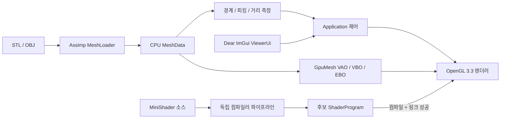

# DentalViz

**C++ 기반 치과 3D 시각화와 MiniShader 실행 환경**

[](https://github.com/leeleemaster/OpenGL_MSVC/actions/workflows/windows-build.yml)
[](https://github.com/leeleemaster/OpenGL_MSVC/releases/tag/v1.0.1-korean)
[](LICENSE)

[▶ 84초 최종 실행 시연](docs/demo/DentalViz-v0.8-portfolio-demo.mp4) ·
[포트폴리오 PDF](output/pdf/DentalViz_Huvitz_Portfolio.pdf) ·
[아키텍처](docs/architecture.md) ·
[성능](docs/performance/benchmark-summary.md) ·
[v1.0.1 소스 태그](https://github.com/leeleemaster/OpenGL_MSVC/tree/v1.0.1-korean)


## 개요

DentalViz는 C++20과 OpenGL 3.3 Core로 구현한 Windows x64 치과용 삼각형 메시
뷰어입니다. STL/OBJ를 불러와 카메라 탐색, 표면 피킹, 두 점의 3D 직선거리 측정,
클리핑 미리보기를 수행합니다. 제한된 재질 DSL인 MiniShader는 입력을 단계별로
검증하고, 성공한 OpenGL 프로그램만 현재 렌더러와 교체합니다.

P0 뷰어와 P1 MiniShader는 완료됐습니다. 기본 화면은 프로젝트에서 직접 만든 비임상
절차 생성 테스트 형상을 사용하며, 의료기기 또는 진단 소프트웨어를 표방하지 않습니다.

## 시연 자료

- [84초 최종 포트폴리오 시연 — 뷰어 + MiniShader](docs/demo/DentalViz-v0.8-portfolio-demo.mp4)
- [12페이지 DentalViz 포트폴리오 PDF](output/pdf/DentalViz_Huvitz_Portfolio.pdf)
- [전체 뷰어](docs/screenshots/01_overview.png)
- [와이어프레임](docs/screenshots/02_wireframe.png)
- [광선 피킹](docs/screenshots/03_picking.png)
- [두 점 사이 3D 거리 측정](docs/screenshots/04_measurement.png)
- [클리핑 미리보기](docs/screenshots/05_clipping.png)
- [MiniShader 실행 중 컴파일 및 적용](docs/screenshots/06_minishader.png)
- [MiniShader 오류와 마지막 정상 셰이더 유지](docs/screenshots/07_minishader_error.png)

모든 화면 자료는 실제 Release 실행 창을 캡처했습니다. 84초 최종 영상은 카메라 조작,
렌더 모드, 피킹과 3D 거리 측정, 클리핑 미리보기, MiniShader의 정상 적용과 오류 시
마지막 정상 셰이더 유지를 한 흐름으로 보여줍니다.

## 주요 기능

| 영역 | 구현 결과 |
|---|---|
| 렌더링 | VAO/VBO/EBO 인덱스 메시, Blinn–Phong, 와이어프레임, 법선 색상 |
| 카메라 | 회전/이동/확대·축소, 경계 기반 화면 맞춤, DPI 독립 뷰어 좌표 |
| 모델 입출력 | Assimp 기반 STL/OBJ, 노드 변환·법선·인덱스 공통 `MeshData` 변환 |
| 피킹 | 뷰어 좌표 → 월드 광선, AABB 선별, Möller–Trumbore 최근접 삼각형 |
| 거리 측정 | 선택한 두 표면점 사이의 3D 유클리드 직선거리와 화면 라벨 |
| 클리핑 | 모델 좌표 평면의 양의 반공간을 버리는 프래그먼트 미리보기 |
| MiniShader | 어휘 분석 → 구문 분석/AST → 의미 분석 → GLSL → 후보 OpenGL 컴파일/링크 |
| 안전성 | 이동 전용 GL RAII, 마지막 정상 셰이더, NaN/과대/손상 입력 방어 |

## 아키텍처



OpenGL이 필요 없는 기하·카메라·MiniShader 컴파일러는 `dentalviz_core`에 두고,
OpenGL 핸들은 실행 파일의 이동 전용 렌더러 타입이 소유합니다. 자세한 의존 방향,
좌표 변환, P0/P1/P2 범위와 기술 선택 근거는 [아키텍처](docs/architecture.md)에
정리했습니다.

## 설계 결정

| 결정 | 이유와 경계 |
|---|---|
| CPU 메시와 GPU 메시 분리 | 파일/기하 테스트는 GL 컨텍스트 없이 실행하고 GPU 핸들 수명은 RAII로 한정 |
| 버튼 기반 컴파일 및 적용 | 편집 중 렌더러 변경을 막고 명시적인 후보 검증 시점 제공 |
| 마지막 정상 셰이더 | DSL 또는 드라이버 실패 시 직전 성공 프로그램과 화면을 그대로 유지 |
| 직접 OpenGL 3.3 파이프라인 | 핵심 렌더링·좌표·자원 수명 학습 근거를 코드로 노출 |
| VTK 제외 | 포트폴리오 범위에서 핵심 구현을 가리지 않고 빌드·배포 표면을 제한 |
| 전체 GLSL 재구현 제외 | 재질 표현에 필요한 작은 DSL만 검증하고 최종 컴파일은 표준 GL 드라이버에 위임 |

## 빌드

Visual Studio 2022의 **Desktop development with C++** 워크로드가 필요합니다. 일반
PowerShell에서 Visual Studio 내장 CMake와 vcpkg를 자동 탐색합니다.

```powershell
./scripts/build.ps1 -Configuration Debug
./scripts/build.ps1 -Configuration Release
```

Microsoft `C/C++` 및 `CMake Tools` 확장이 설치된 VS Code에서 저장소를 신뢰한 뒤 `F5`를
누르면 Debug 빌드, 테스트, 실행이 이어집니다. `Ctrl+Shift+B`는 기본 Debug 빌드입니다.

```powershell
./out/build/msvc/Debug/DentalViz.exe
./out/build/msvc/Debug/DentalViz.exe --model "C:\Models\dental.stl"
```

Windows ZIP은 셰이더와 제3자 고지를 포함해 `out/`에 생성됩니다. 공개 다운로드는
[`v1.0.1-korean` 릴리스](https://github.com/leeleemaster/OpenGL_MSVC/releases/tag/v1.0.1-korean)에서
제공하며, 아래 명령으로 동일한 구조를 재현할 수 있습니다.

```powershell
./scripts/package.ps1 -Configuration Release
```

## 테스트

Debug와 Release 빌드 뒤 63개 Catch2 테스트가 자동 실행되며 MSVC `/W4 /WX`를 사용합니다.
기하, 로더, 카메라, 피킹, 거리 측정, 어휘·구문·의미 분석, GLSL 생성기와
손상·NaN·과대·과도한 중첩 입력을 포함합니다.

실제 GPU 검증은 별도 명령으로 실행합니다.

```powershell
./scripts/verify-runtime-hardening.ps1
./scripts/verify-minishader-runtime.ps1
```

단계별 로컬 증거는 [`docs/verification/`](docs/verification/)에 기록했습니다.

## 성능

2026-08-17, Release, 1280×720, VSync 해제, NVIDIA GeForce RTX 5070 Ti/OpenGL 3.3에서
워밍업 후 측정한 값입니다.

| 모델 | 삼각형 | 불러오기 중앙값 | 업로드 중앙값 | CPU 프레임 중앙값 / p95 | 피킹 중앙값 / p95 |
|---|---:|---:|---:|---:|---:|
| 100k | 100,008 | 81.500 ms | 0.851 ms | 0.286 / 0.476 ms | 0.663 / 0.684 ms |
| 500k | 500,004 | 477.794 ms | 3.337 ms | 0.516 / 1.012 ms | 3.321 / 3.413 ms |

업로드는 `glFinish`까지의 CPU 관측 벽시계 시간이며 GPU 타이머 쿼리가 아닙니다. CPU 프레임
역시 GPU 실행 시간이 아닙니다. 조건·반복 횟수·1,246개 원시 샘플은
[요약](docs/performance/benchmark-summary.md)과
[CSV](docs/performance/benchmark-raw.csv)에 있습니다.

```powershell
./scripts/run-benchmark.ps1
```

## 제한 사항

- STL/OBJ의 실제 길이 단위를 추론하지 않으므로 측정값은 `모델 단위`입니다.
- 측정은 두 점 사이의 3D 직선거리이며 표면을 따르는 측지 거리가 아닙니다.
- 클리핑은 프래그먼트 폐기 미리보기이며 단면 메시 또는 덮개를 생성하지 않습니다.
- 피킹은 AABB 이후 모든 삼각형을 검사하며 BVH는 P2 범위입니다.
- MiniShader는 제한된 재질 DSL이며 임의 GLSL 또는 자동 변경 감지가 아닙니다.
- 임상 검증, DICOM/볼륨 렌더링, 의료기기 안전 요구사항은 범위 밖입니다.

## 라이선스와 자산 출처

소스 코드는 [MIT 라이선스](LICENSE)로 배포합니다. Windows ZIP은 사용한 vcpkg 패키지의
저작권 고지를 `third-party-licenses/`에 포함합니다. 재배포 출처와 라이선스가 확인된
치과 STL은 아직 번들하지 않으며, [모델 고지](assets/models/LICENSE.txt)에 따라
프로젝트 작성 절차 생성 테스트 형상만 사용합니다.
