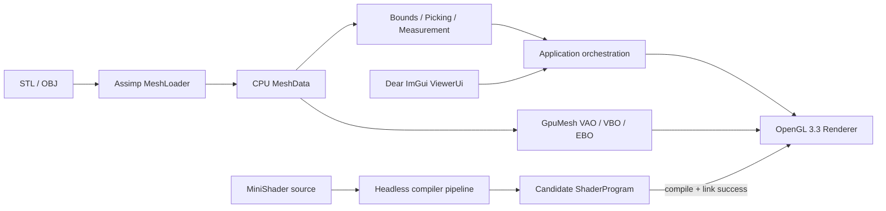

# DentalViz

**C++ Dental 3D Visualization with MiniShader Runtime**

[](https://github.com/leeleemaster/OpenGL_MSVC/actions/workflows/windows-build.yml)
[](https://github.com/leeleemaster/OpenGL_MSVC/tree/v0.8-minishader)
[](LICENSE)

[▶ 50초 실제 실행 Demo](docs/demo/DentalViz-v0.5-viewer-demo.mp4) ·
[Architecture](docs/architecture.md) ·
[Performance](docs/performance/benchmark-summary.md) ·
[v0.8 Source Tag](https://github.com/leeleemaster/OpenGL_MSVC/tree/v0.8-minishader)


## Overview

DentalViz는 C++20과 OpenGL 3.3 Core로 구현한 Windows x64 치과용 삼각형 메시
뷰어입니다. STL/OBJ를 불러와 카메라 탐색, 표면 Picking, 두 점의 3D 직선거리 측정,
Clipping Preview를 수행합니다. 제한된 Material DSL인 MiniShader는 입력을 단계별로
검증하고, 성공한 OpenGL 프로그램만 현재 렌더러와 교체합니다.

P0 Viewer와 P1 MiniShader는 완료됐습니다. 기본 화면은 프로젝트에서 직접 만든 비임상
절차 생성 테스트 형상을 사용하며, 의료기기 또는 진단 소프트웨어를 표방하지 않습니다.

## Demo

- [전체 Viewer](docs/screenshots/01_overview.png)
- [Wireframe](docs/screenshots/02_wireframe.png)
- [Ray Picking](docs/screenshots/03_picking.png)
- [3D Point-to-Point Measurement](docs/screenshots/04_measurement.png)
- [Clipping Preview](docs/screenshots/05_clipping.png)
- [MiniShader Runtime Compile & Apply](docs/screenshots/06_minishader.png)
- [MiniShader 오류와 Last Known Good](docs/screenshots/07_minishader_error.png)

모든 화면 자료는 실제 Release 실행 창을 캡처했습니다. 현재 50초 영상은 P0 Viewer를
보여주며, MiniShader까지 포함한 60~90초 최종 영상은 Commit 23 산출물로 추가합니다.

## Features

| 영역 | 구현 결과 |
|---|---|
| Rendering | VAO/VBO/EBO indexed mesh, Blinn–Phong, Wireframe, Normal Color |
| Camera | Orbit/Pan/Zoom, Bounds 기반 Fit, DPI 독립 Viewer 좌표 |
| Model I/O | Assimp 기반 STL/OBJ, 노드 변환·법선·인덱스 공통 `MeshData` 변환 |
| Picking | Viewer 좌표 → World Ray, AABB gate, Möller–Trumbore 최근접 삼각형 |
| Measurement | 선택한 두 표면점 사이의 3D Euclidean 직선거리와 화면 라벨 |
| Clipping | 모델 좌표 Plane의 positive half-space를 버리는 Fragment Preview |
| MiniShader | Lexer → Parser/AST → Semantic → GLSL → 후보 OpenGL Compile/Link |
| Safety | Move-only GL RAII, Last Known Good, NaN/과대/손상 입력 방어 |

## Architecture



OpenGL이 필요 없는 geometry·camera·MiniShader compiler는 `dentalviz_core`에 두고,
OpenGL handle은 실행 파일의 move-only renderer 타입이 소유합니다. 자세한 의존 방향,
좌표 변환, P0/P1/P2 범위와 기술 선택 근거는 [Architecture](docs/architecture.md)에
정리했습니다.

## Engineering Decisions

| 결정 | 이유와 경계 |
|---|---|
| CPU Mesh와 GPU Mesh 분리 | 파일/기하 테스트는 GL context 없이 실행하고 GPU handle 수명은 RAII로 한정 |
| 버튼 기반 Compile & Apply | 편집 중 렌더러 변경을 막고 명시적인 후보 검증 시점 제공 |
| Last Known Good Shader | DSL 또는 드라이버 실패 시 직전 성공 프로그램과 화면을 그대로 유지 |
| 직접 OpenGL 3.3 Pipeline | 핵심 렌더링·좌표·자원 수명 학습 근거를 코드로 노출 |
| VTK 제외 | 포트폴리오 범위에서 핵심 구현을 가리지 않고 빌드·배포 표면을 제한 |
| 전체 GLSL 재구현 제외 | Material 표현에 필요한 작은 DSL만 검증하고 최종 컴파일은 표준 GL driver에 위임 |

## Build

Visual Studio 2022의 **Desktop development with C++** 워크로드가 필요합니다. 일반
PowerShell에서 Visual Studio 내장 CMake와 vcpkg를 자동 탐색합니다.

```powershell
./scripts/build.ps1 -Configuration Debug
./scripts/build.ps1 -Configuration Release
```

Microsoft `C/C++` 및 `CMake Tools` 확장이 설치된 VS Code에서 저장소를 신뢰한 뒤 `F5`를
누르면 Debug 빌드, 테스트, 실행이 이어집니다. `Ctrl+Shift+B`는 기본 Debug 빌드입니다.

```powershell
./out/build/msvc/Debug/DentalViz.exe
./out/build/msvc/Debug/DentalViz.exe --model "C:\Models\dental.stl"
```

Windows ZIP은 Shader와 제3자 고지를 포함해 `out/`에 생성됩니다. 공개 다운로드는 최종
`v1.0-submission` Release에서 고정하며, 현재 패키지는 아래 명령으로 재현할 수 있습니다.

```powershell
./scripts/package.ps1 -Configuration Release
```

## Tests

Debug와 Release 빌드 뒤 63개 Catch2 테스트가 자동 실행되며 MSVC `/W4 /WX`를 사용합니다.
Geometry, Loader, Camera, Picking, Measurement, Lexer, Parser, Semantic, GLSL Generator와
손상·NaN·과대·과도한 중첩 입력을 포함합니다.

실제 GPU 검증은 별도 명령으로 실행합니다.

```powershell
./scripts/verify-runtime-hardening.ps1
./scripts/verify-minishader-runtime.ps1
```

단계별 로컬 증거는 [`docs/verification/`](docs/verification/)에 기록했습니다.

## Performance

2026-08-17, Release, 1280×720, VSync Off, NVIDIA GeForce RTX 5070 Ti/OpenGL 3.3에서
워밍업 후 측정한 값입니다.

| Model | Triangles | Load median | Upload median | CPU frame median / p95 | Picking median / p95 |
|---|---:|---:|---:|---:|---:|
| 100k | 100,008 | 81.500 ms | 0.851 ms | 0.286 / 0.476 ms | 0.663 / 0.684 ms |
| 500k | 500,004 | 477.794 ms | 3.337 ms | 0.516 / 1.012 ms | 3.321 / 3.413 ms |

Upload은 `glFinish`까지의 CPU 관측 벽시계 시간이며 GPU timer query가 아닙니다. CPU Frame
역시 GPU 실행 시간이 아닙니다. 조건·반복 횟수·1,246개 원시 샘플은
[요약](docs/performance/benchmark-summary.md)과
[CSV](docs/performance/benchmark-raw.csv)에 있습니다.

```powershell
./scripts/run-benchmark.ps1
```

## Limitations

- STL/OBJ의 실제 길이 단위를 추론하지 않으므로 측정값은 `model units`입니다.
- 측정은 두 점 사이의 3D 직선거리이며 표면을 따르는 geodesic distance가 아닙니다.
- Clipping은 fragment discard 미리보기이며 단면 mesh 또는 cap을 생성하지 않습니다.
- Picking은 AABB 이후 모든 삼각형을 검사하며 BVH는 P2 범위입니다.
- MiniShader는 제한된 Material DSL이며 임의 GLSL 또는 자동 Hot Reload가 아닙니다.
- 임상 검증, DICOM/volume rendering, 의료기기 안전 요구사항은 범위 밖입니다.

## License and Asset Attribution

소스 코드는 [MIT License](LICENSE)로 배포합니다. Windows ZIP은 사용한 vcpkg 패키지의
저작권 고지를 `third-party-licenses/`에 포함합니다. 재배포 출처와 라이선스가 확인된
Dental STL은 아직 번들하지 않으며, [모델 고지](assets/models/LICENSE.txt)에 따라
프로젝트 작성 절차 생성 테스트 형상만 사용합니다.
