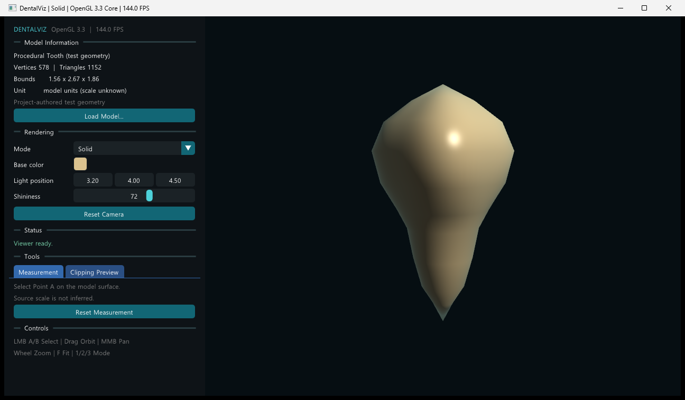

# DentalViz

C++20과 OpenGL을 이용해 치과용 삼각형 메시를 탐색하고 측정하는 Windows 데스크톱 뷰어입니다.

[](https://github.com/leeleemaster/OpenGL_MSVC/actions/workflows/windows-build.yml)
[50초 Viewer Demo](docs/demo/DentalViz-v0.5-viewer-demo.mp4)



현재 단계는 STL/OBJ 메시 탐색·측정·Clipping Preview를 제공하는 P0 Viewer Release입니다.
기본 화면은 프로젝트에서 직접 만든 비임상 절차 생성 테스트 형상을 사용합니다.

## 목표 기능

- OpenGL 3.3 Core 기반 메시 렌더링
- Orbit/Pan/Zoom 카메라와 모델 맞춤 보기
- STL 메시 로딩과 모델 정보 표시
- Ray–Triangle 기반 Picking
- 두 표면점 사이의 3D 직선거리 측정
- Fragment discard 기반 Clipping Preview
- 선택 기능: MiniShader Runtime Compile & Apply

## 데모와 스크린샷

- [Overview](docs/screenshots/01_overview.png)
- [Wireframe](docs/screenshots/02_wireframe.png)
- [Ray Picking](docs/screenshots/03_picking.png)
- [3D Point-to-Point Measurement](docs/screenshots/04_measurement.png)
- [Clipping Preview](docs/screenshots/05_clipping.png)

스크린샷과 Demo는 실제 Release 실행 창을 자동 조작해 생성합니다.

```powershell
./scripts/capture-screenshots.ps1
python ./scripts/capture-demo.py
```

Demo 자동 캡처에는 Python 3와 `opencv-python`, `numpy`, `Pillow`가 필요합니다.

## 로컬 빌드

Visual Studio 2022에서 **Desktop development with C++** 워크로드가 설치되어 있어야 합니다.
일반 PowerShell에서 다음 스크립트를 실행하면 Visual Studio에 포함된 CMake와 vcpkg를 자동으로 찾습니다.

```powershell
./scripts/build.ps1 -Configuration Debug
./scripts/build.ps1 -Configuration Release
```

빌드 결과는 `out/build/msvc/`에 생성됩니다. 테스트는 빌드 후 자동으로 실행됩니다.

재배포 가능한 Shader와 제3자 라이선스 고지를 포함한 Windows x64 ZIP은 다음 명령으로
생성합니다. 결과는 `out/DentalViz-v0.5-viewer-windows-x64.zip`입니다.

```powershell
./scripts/package.ps1 -Configuration Release
```

Debug 실행 파일은 다음과 같이 실행합니다. 왼쪽 드래그는 Orbit, 가운데 드래그는 Pan,
왼쪽 짧은 클릭은 측정점 A/B 선택, 휠은 Zoom, `F`는 모델 맞춤입니다. 두 번째 점을
선택하면 두 점 사이의 3D 직선거리와 연결선이 표시되고, 세 번째 유효 클릭은 새 A로
다시 시작합니다. 숫자 `1`, `2`, `3`으로 각각 Solid, Wireframe,
Normal Color 모드를 선택하며 `Escape` 또는 닫기 버튼으로 종료합니다. Properties 패널에서는
모델 정보, FPS, 상태·오류를 확인하고 색상, 조명, 광택, 렌더 모드를 즉시 조정할 수 있습니다.
`Clipping Preview` 탭에서는 클리핑을 켜고 +X/+Y/+Z 법선과 평면 거리 `d`를 조절할 수
있습니다. 평면은 모델 좌표계에 고정되므로 카메라를 움직여도 모델에 대한 위치가 바뀌지
않습니다. 이 기능은 Fragment Shader가 평면 바깥 조각을 버리는 미리보기이며, 잘린 단면을
새 형상으로 생성하거나 채우지는 않습니다.

```powershell
./out/build/msvc/Debug/DentalViz.exe
```

외부 STL 또는 OBJ를 시작 시 로드할 수 있습니다. 로더는 파일의 실제 길이 단위를
추론하지 않으므로 측정값은 `model units`로 표시하며 임의로 mm라고 단정하지 않습니다.

```powershell
./out/build/msvc/Debug/DentalViz.exe --model "C:\Models\dental.stl"
```

파일이 없거나 손상된 경우 오류를 출력하고 절차 생성 테스트 치아로 복구합니다.
실행 후에는 Properties 패널의 `Load Model...` 버튼으로 Windows 파일 선택 창을 열어 다른
STL/OBJ로 교체할 수 있습니다. 한글이 포함된 Windows 경로도 지원합니다.

### VS Code

Microsoft `C/C++` 및 `CMake Tools` 확장이 설치된 VS Code에서 저장소 폴더를 신뢰한 뒤
`F5`를 누르면 Debug 빌드, 테스트, 실행이 순서대로 진행됩니다. `Ctrl+Shift+B`는 기본
Debug 빌드를 실행하며, `Tasks: Run Task`에서 Release 빌드도 선택할 수 있습니다.

## 현재 상태

- [x] 범위, 좌표계, 완료조건 고정
- [x] CMake/MSVC/vcpkg 골격
- [x] Catch2 Smoke Test
- [x] Windows GitHub Actions 구성
- [x] OpenGL Window와 Application Loop
- [x] Indexed GPU Mesh와 Blinn–Phong 테스트 렌더링
- [x] 절차 생성 치아의 법선·경계·인덱스 단위 테스트
- [x] Orbit/Pan/Zoom과 Bounds 기반 `F` 모델 맞춤 카메라
- [x] 외부 GLSL 로딩과 파일·단계별 컴파일 오류 표시
- [x] Blinn–Phong Solid/Wireframe/Normal Color 렌더 모드
- [x] Assimp 기반 STL/OBJ 로딩, 법선·인덱스·노드 변환 전처리
- [x] Dear ImGui Properties UI, Windows 모델 선택, 상태·오류 표시
- [x] DPI 독립 Viewer Ray, AABB 가속, Moller-Trumbore 최근접 표면 Picking
- [x] 클릭/드래그 구분, 선택 좌표·법선·삼각형 정보와 화면 마커
- [x] 두 표면점 A/B의 3D 직선거리, 연결선, 거리 라벨과 측정 초기화
- [x] 모델 좌표 기반 +X/+Y/+Z Plane Clipping Preview와 실시간 거리 조절
- [x] 실행 파일 기준 Asset 탐색, Windows x64 ZIP, 별도 폴더 Release Smoke Test
- [x] 실제 Viewer 스크린샷 5장과 50초 P0 Demo
- [x] MiniShader MVP EBNF, 타입 규칙, 내장 심볼과 오류 정책 고정
- [x] MiniShader Token Stream, 주석 처리와 1-based Source Location Lexer
- [x] MiniShader Recursive Descent Parser, 연산자 우선순위와 `unique_ptr` AST
- [ ] 출처와 재배포 라이선스가 확인된 Dental STL 확보

자세한 범위와 기술 결정은 [`docs/scope.md`](docs/scope.md),
[`docs/coordinate-system.md`](docs/coordinate-system.md),
[`docs/architecture.md`](docs/architecture.md)를 참고하세요. P1 MiniShader의 구현 기준은
[`docs/minishader-language.md`](docs/minishader-language.md)에 고정되어 있습니다. 실제 OpenGL
로컬 실행 결과는 [`docs/verification/`](docs/verification/)에 단계별로 기록되어 있습니다.

## 라이선스

소스 코드는 MIT License로 배포합니다. 모델과 제3자 라이브러리는 각각의 라이선스를 따릅니다.
