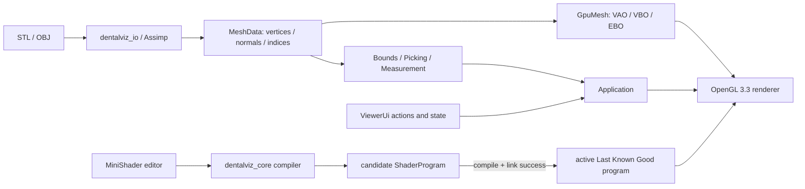

# Architecture

## Design goal

DentalViz keeps the portfolio-critical OpenGL pipeline visible while moving geometry, loading,
camera math, and MiniShader compilation behind context-free boundaries. The executable coordinates
those parts; it does not turn the UI, loader, or compiler into owners of renderer resources.



## Why the Viewer and Shader Compiler are separated

The MiniShader compiler accepts text and returns GLSL or structured diagnostics without touching
GLFW, GLAD, or an OpenGL handle. Lexer, Parser, Semantic Analyzer, and GLSL Generator therefore run
in ordinary Catch2 tests and on CI runners without a graphics context. The Viewer owns the separate
driver compile/link boundary because only it knows the current OpenGL context and active program.

This separation also makes the failure contract explicit: a language failure produces no GLSL; a
driver failure destroys only the temporary candidate; only a fully linked candidate can replace the
active `ShaderProgram`.

## Why CPU Mesh and GPU Mesh are separated

`MeshData` is the canonical CPU representation shared by procedural geometry and Assimp imports.
Bounds, normals, Picking, and measurement can inspect it directly and remain testable. `GpuMesh`
owns only VAO/VBO/EBO handles and the draw count. Upload is an explicit transition, and move-only
ownership prevents accidental OpenGL handle copies or double deletion.

Interactive model replacement follows the same candidate policy as Shader replacement: load and
validate CPU data, create a candidate `GpuMesh`, then replace the current CPU/GPU pair. A corrupt
file or failed upload leaves the previous model available.

## Dependency direction

```text
DentalViz executable
  -> app / ui / renderer / platform / io
  -> dentalviz_core (geometry and shared domain types)
  -> Dear ImGui GLFW/OpenGL3 backends

dentalviz_io
  -> dentalviz_core / Assimp

dentalviz_tests
  -> dentalviz_core / dentalviz_io
```

`dentalviz_core` must not require an OpenGL context. Geometry intersection, measurement,
bounds, model-space clipping-plane math, camera math that can be isolated, and the optional
MiniShader compiler belong in testable code. OpenGL handles remain inside renderer-side RAII
types.

`dentalviz_io` converts Assimp scenes, node transforms, positions, normals, and triangle
indices into the same `MeshData` used by procedural geometry. File parsing remains independent
of the OpenGL context and is tested with project-authored non-clinical fixtures.

`ViewerUi` owns the Dear ImGui context and backend lifetime, emits UI actions, and stores the
window-space plus framebuffer-space viewer rectangle. The application remains responsible for
model loading, GPU replacement, camera fitting, and rendering state. The Windows native file
dialog is isolated under `src/platform`.

## Viewport decision

P0 uses a fixed properties sidebar and renders the scene directly into the remaining
framebuffer rectangle with `glViewport` and `glScissor`. This avoids an early framebuffer
object dependency. Picking uses the same recorded rectangle and DPI conversion.

Camera input is accepted only while the GLFW cursor is inside that viewer rectangle and Dear
ImGui does not request capture. This prevents panel drags and wheel events from changing the
camera while preserving the exact coordinate rectangle needed by the later picking stage.

An FBO-backed ImGui image viewport is a later refactor only if docking or multiple viewports
becomes necessary.

## Coordinate system and Picking transformation

The current model transform is identity and mesh positions remain in model/world coordinates.
The camera uses a right-handed view and OpenGL clip/NDC conventions. A click is converted through
one recorded Viewer rectangle so rendering and Picking share the same DPI-aware bounds:

```text
window cursor
  -> Viewer-local normalized [0, 1] position
  -> OpenGL NDC [-1, 1] with Y inversion
  -> inverse(projection * view) far point
  -> normalized world ray from camera position
  -> model AABB gate
  -> nearest positive Möller-Trumbore triangle hit
```

If a non-identity model matrix is introduced later, the world ray must be transformed by the inverse
model matrix before the existing mesh-space intersection. STL and OBJ scale metadata is not trusted,
so all distances remain `model units` unless an explicit scale policy is added.

## Resource ownership

- CPU mesh data owns positions, normals, indices, and bounds.
- GPU mesh data owns VAO/VBO/EBO handles through move-only RAII objects.
- Upload and draw are separate operations.
- Runtime shaders are loaded from `assets/shaders` and copied beside each built executable.
- Runtime asset lookup checks the executable directory first, then the working directory and
  source-tree fallback. A packaged executable therefore runs correctly from an unrelated current
  working directory.
- A shader replacement becomes active only after compile and link succeed.
- UI communicates commands and state; it does not own renderer resources.
- Clipping state stores a model-space axis normal and plane distance. The mesh vertex shader
  forwards the original model position and the fragment shader discards only the positive
  half-space, so camera changes cannot move the plane relative to the model. No cap geometry
  is generated.

The application owns the GLFW context for its full lifetime. Function-local `ViewerUi`, marker,
shader, and mesh RAII objects are destroyed before `Application` destroys the window and terminates
GLFW, so every OpenGL deletion runs while the context is still current.

## MiniShader runtime boundary

The MiniShader compiler remains in `dentalviz_core` and requires no OpenGL context:

```text
Editor source
  -> Lexer -> Parser/AST -> Semantic Analyzer -> GLSL Generator
  -> candidate OpenGL compile/link -> active ShaderProgram
```

Lexical, syntax, or semantic failure returns diagnostics before GLSL is produced. The application
constructs a separate candidate `ShaderProgram` for driver compilation and linking. Move assignment
replaces the active program only after the candidate is complete, so any failure preserves the
Last Known Good program and the rendered scene. This pipeline runs only for the UI's
`Compile & Apply` action; editing source alone has no renderer side effect.

The generated fragment template retains model-space clipping and Normal Color mode. Fragment
uniforms are set only when the linked program exposes them because a valid MiniShader may not use
`baseColor` or `lightDir`, allowing the driver to optimize those uniforms away.

## P0, P1, and P2 scope decision

- **P0 Viewer** is the submission-safe product: build, rendering, camera, model loading, UI,
  Picking, straight-line measurement, Clipping Preview, packaging, and visual evidence.
- **P1 MiniShader** is bounded differentiation: a small Material language, deterministic GLSL,
  explicit Compile & Apply, and Last Known Good preservation.
- **P2** contains work that is useful but not necessary for the submission: file Hot Reload, BVH,
  GPU timer queries, clipping cap generation, geodesic distance, docking, and multiple viewports.

The boundary keeps an optional compiler feature from delaying a usable Viewer and prevents planned
features from being described as implemented behavior.

## Why VTK and a full GLSL reimplementation are excluded

VTK is a mature option for medical and scientific visualization, but adopting it here would hide
the OpenGL resource lifetime, render pipeline, and Picking transformations that this portfolio is
intended to demonstrate. It would also enlarge the build and distribution surface without adding
the DICOM or volume-rendering workflows needed to justify that dependency. A production medical
viewer could make a different trade-off.

MiniShader is deliberately not a general GLSL replacement. Reimplementing control flow, storage,
stage interfaces, overload resolution, precision, and driver validation would dominate the project
and create misleading language-support claims. The bounded DSL expresses only material arithmetic;
it generates standard GLSL 3.30, and the OpenGL driver remains the final compiler and linker.

## Release linkage

The baseline vcpkg triplet is `x64-windows-static-md-gl33`: third-party libraries are
statically linked while the MSVC runtime remains dynamically linked. The custom triplet also
generates GLAD for the OpenGL 3.3 Core profile. This minimizes application DLL packaging while
remaining compatible with the normal Visual C++ runtime deployment model.
